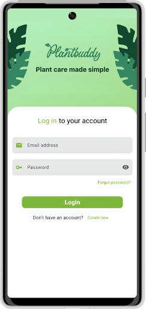
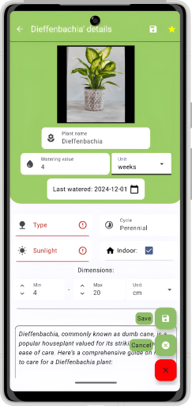

# Plant Care Application

This Android application is designed to assist users in managing and caring for their plants. It allows users to add, categorize, and manage their plants, set up watering notifications, and access AI-generated tips for better care.

## Key Features
- **Save Plants:** Users can add their plants by specifying names, types, watering schedules, and other details.
- **Notifications:** The app sends reminders when it's time to water a plant.
- **API Integration:** Retrieve detailed information about plants from an online database.
- **Image-Based Plant Identification:** Identify plants using images captured with the device's camera.
- **AI-Powered Suggestions:** Provides tips and advice using artificial intelligence for both user-added and online plants.

## Technologies
The application leverages the following technologies:
- **Android (Kotlin):** The platform for the application.
- **Jetpack Compose:** A modern, declarative UI development framework.
- **Firebase:** Backend services like Authentication, Firestore, and Storage.
- **Retrofit:** For API communication.
- **Dagger-Hilt:** For dependency injection, ensuring modular and maintainable code.
- **Perenual API:** To fetch plant data from an external database.
- **Aiml API:** Provides AI-powered features, including text and image-based analysis.
- **Kindwise plant.id API:** Enables image-based plant identification with additional health analysis.

## Design Patterns and Architecture

This application follows a **three-layer architecture**:
- **Presentation Layer:** Built with Jetpack Compose and MVVM, separating UI logic from business logic.
- **Domain Layer:** Implements the Interactor pattern to handle business logic and use cases.
- **Data Layer:** Uses the Repository pattern to provide a unified interface for accessing remote and local data sources.

Key patterns include:
- **Dependency Injection:** Implemented using Dagger-Hilt for modularity and testability.
- **Repository Pattern:** Abstracts data access and integrates with APIs and Firestore.
- **Interactor Pattern:** Manages business logic and communicates between the ViewModel and Repository layers.

---

For more information, please refer to the [full documentation](./Novenygondozast-tamogato-alkalmazas-Dolgozat-1.pdf).

## Screenshots

*Login screen*

*User's saved plants and search funcionality*

*User's plant details screen, without editing mode*

*User's plant details screen, with editing mode on*

*Details Screen of the plants from the API*

